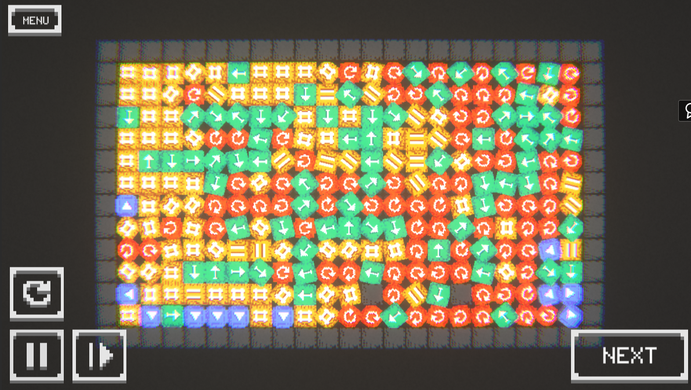

Hi **@everyone**!

This is the first article here.

Might as well introduce myself!

I am Lia Milenakos - a transfem lesbian catgirl who goes by she/her.

I'm mostly known for my *Cat Bot* as well as my *Cell Machine* adventures.

# What is Cat Bot?

**Cat Bot** is a Discord bot I have been working on for the past two years. The core concept is the following:

- Cats spawn in a specific channel
- First to catch the cat gets it
- Collect many cats
- Get into the leaderboards
- Collect achievements
- Have fun

All data is separate between servers creating an equal and fun experience.

I'm sure this won't be my last time mentioning Cat Bot and you most likely already know what it is.

# What is Cell Machine?

**Cell Machine** was originally a game developed by Sam Hogan in 48 hours for a game jam, consisting of 17 levels. Many people quickly fell in love with this celluar automata and wanted a sandbox mode, which is how first Cell Machine mods were created.

The most popular Cell Machine game at the moment is [Cell Machine Mystic Mod](https://themysticlynx.itch.io/cell-machine-mystic-mod), or CMMM for short. I myself have created many modifications of CMMM and a few other Cell Machines, which you can find on my [itch.io page](https://milenakos.itch.io).

[My YouTube channel](https://youtube.com/@Milenakos), which has gotten 2.8K subscribers at the time of writing, is dedicated to Cell Machine content.

I am currently working on Schemacell - a CMMM mod which will allow for creation of custom cells in Lua language.

# Conclusion

On this blog you can expect posts about Cat Bot and Schemacell development, some other nerd stuff, announcements of new projects or miscellaneous topics (e.g. gender).

Meow meow,
