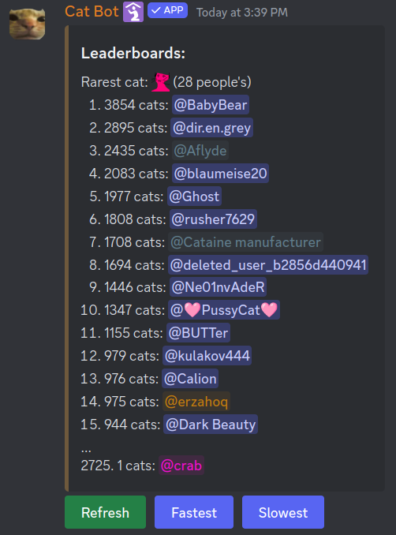

When making leaderboards for Cat Bot, I quickly noticed the problem of speed - counting and sorting hundreds of entries is pretty slow.

After thinking for a bit I noticed that you *don't actually need* to sort all entires. You only need to sort top 15.

# Partial sorting with heapq

Conveniently, Python has a built-in library for such things - [heapq](https://docs.python.org/3/library/heapq.html).

It can be used as such:

```py
>>> import heapq
>>> heap = [(69, '1'), (145, '2'), (3, '3'), (72, '4')]
>>> heapq.nlargest(2, heap)
[(145, '2'), (72, '4')]
```

Great! Now we can use that for our leaderboards. However, I would like to show where the person who ran the command is placed even if they are outside of top 15. How to do that?

# Finding the position of an invidiual element

This might sound tricky, but it is actually stupidly simple.

We go through the entire list and if the value is bigger than us, we add one to our placement.

```py
user_placement = 1
for i in cat_counts.values():
    if user_score <= i:
        user_placement += 1
```

(`<=` instead of `<` will make sure we are pushed down in the rankings in ties, otherwise we might conflict if we have the same number as #15.)

Then we check if the placement is above 15 (otherwise it wouldn't be nessecary as you will already see yourself), and add it to the end:

```py
if user_placement > 15:
    leaderboards_string += f"...\n{user_placement}\. {user_score} {user.mention}"
```

Notice how we escape the dot after the number to prevent discord's numbering list markdown from ruining our day (it doesn't like numbers above 100).

In reality, along with the user who ran the command, I also show the placement of the person who pressed the button if there is any.


