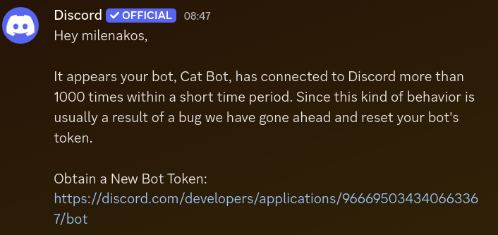

Software, as opposed to hardware, is usually known for it's stability. If the code is the same and it ran fine before, there shouldn't be any reason for it to suddenly stop working: it can't wear out or run out of fuel. Usually known-good software breaks because of a few things:

- Bugs in new updates
- Network issues
- Running out of memory or disk space

Which one is occuring here? Well...

# 1. Unknown Interaction
This is one of the most commmon and widely known issues with Discord affecting bots. Basically, Discord has a somewhat reasonable limitation of 5 seconds to respond to an interaction, after which it will show "Application not responding". This time can be extended by deferring the interaction, extending the time limit to a few minutes. If you try to respond to an interaction after your time has already ran out, you will be met with "Unknown Interaction" error.

Now that all sounds good, except the fact Discord will just sometimes send "Unknown Interaction" if you respond in time. Why? **Some Discord API bug just specifically delays the request and waits until the time is out, then responds with "Unknown Interaction"**. No, I am not kidding. You can see this for yourself [here](https://github.com/discord/discord-api-docs/issues/5558).

An interesting workaround is sending a defer even if an interaction is very simple and primitive and doesn't take any time at all. It seems the bug doesn't trigger for defers, although it's not clear why. Some users do state that adding extra defers doesn't help either. It's a mystery.

There have been little to no acknowledgements of this issue from Discord, despite the issue being open for 2.5 years.

# 2. Sharding
Another good idea gone wrong.

Basically, once your bot gets big (above 2500 servers), having just one open connection with Discord starts to become very inefficient, so you open more connections to Discord. These connections are called shards, and the process is called sharding. A good practice is to have a shard for each 1,000 servers your bot is in.

This is where the weird part comes in. When your bot starts up, Discord has a very weird limit which is that you can only open **1 shard per 5 seconds**. This means that if you have 75,000 servers the bot takes 75*5=375 seconds to start up. (over 6 minutes!)

This is partially resolved once you get to 150,000 servers, where Discord allows you to open 16 shards at once instead (basically a 16x start speedup). And like that's kinda weird why don't you gradually raise the limit (1, 2, 4, 8, 16, ...) the more servers the bot is in? 150k is such a weird number anyway.

This combined with another weirdness results in an absolute nightmare.

# 3. The token reset
Okay imagine this. Everything is gone fine. Now, boom, your internet dies for a few seconds. Interaction responses queue up, but once your internet comes back online, they are all sent at once, causing a massive flood of interactions, resulting in a funny effect where old queued up interactions fail because of the time limit, and new ones fail because they have to wait for old ones in the queue, then also failing because of time limit, and so creating a chain reaction of failures. At this point your shards start to die because of unresponsiveness. This can lead to a cascade effect where more shards die, causing more interactions to fail, and so on. Your shards start to come back up (slowly, remember, 5 seconds per shard), but then die again because of the madness. And this is where the disaster strikes...

A single network blip resulted in a loop of shard dying and restarting in a loop, so Discord has reset your token. Great! The chain has been stopped, right? Well, yes, it was stopped by completely killing the bot until you manually go to the Dev Portal, generate a new token, ssh into your server to update the env, and restart the bot. Even if you are not asleep and can do this instantly, it will still result in a few minutes downtime because of the shard time limit!

Now remember when I said it was caused by a "network blip"? You see, this is where it starts to get interesting. This madness happens without fail every few days on multiple hosts I tried it on, usually when the last "hard restart" (that's how I call a full 6-minute restart with reconnection of all shards) hasn't been done for a couple of days. Unfortunately I do not have closure here as I do not know the actual cause of this but regardless, the effects of this are horrible. Whatever is happening here should NOT basically knock your bot offline until you manually fix it. I hate Discord bot programming.

And to be clear, it is not out of RAM or disk space either. It is either a Discord bug, a discord.py bug or all hosts I have tried just have very unreliable network which breaks every few days.

# Conclusion
I want to jump off a bridge. Stuff just seems to randomly break completely on its own like the bot is sentient. And I didn't even get into ratelimits here.
