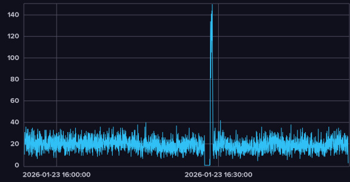
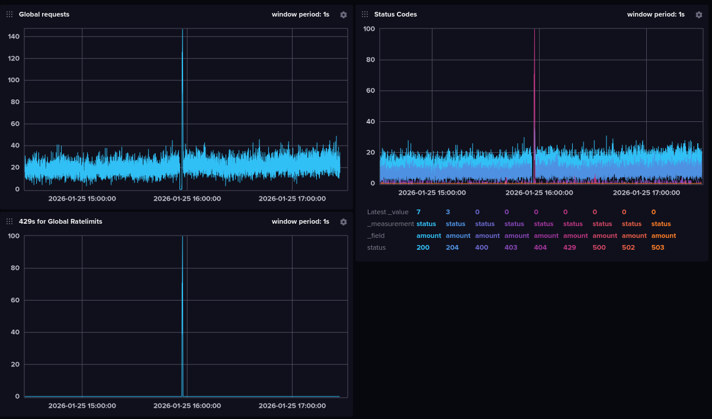
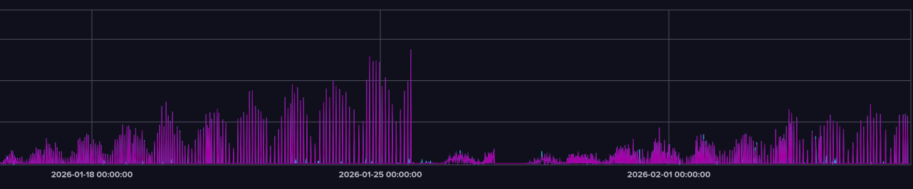

# Introduction

If you used Cat Bot for prolonged periods of time or ever visited the [#yapping channel in Cat Stand](https://discord.com/channels/966586000417619998/1238190740937379850), you would know ratelimits have been an issue for me for years. I think it would be fun and informative to go through literally everything I ever tried to fix them, so strap in because I will be explaining a LOT in detail. (There are story-telling simplifications)

# 1. Ratelimits

> ok but what are you even rambling about???

Ratelimits are quite a simple concept - to prevent users from spamming a service the developer (in this case Discord) adds a limit to how many requests can be done in a specific time frame.

Discord has multiple types of ratelimits:

- Per-route/bucket ratelimits apply to a single "bucket", and sometimes are shared for multiple users. Examples: sending a message in a channel, uploading emojis to a server, creating channels. These ratelimits only apply to one specific place, and usually aren't worrisome (if you hit a per-route send message ratelimit, the bot will be unable to send a message in only that channel for a short while)
- Cloudflare bans. This is a limit of how many invalid (error) requests you can send, and is 10,000 per 10 minutes. Those can be easily avoided by not retrying failures (this is the reason Cat Bot un-setups itself if it fails to send a cat), and are generally quite hard to hit even for big bots.
- The topic of today - global ratelimits. These are quite simple: you can only do 50 requests/second. However, this does NOT include any slash command related requests (such as responding to slash commands, editing the responses, showing modals/popups, sending additional responses on button clicks...), but does count everything else, from message sending and deleting to reaction adding.

You might already notice an issue with global ratelimits - the very short window. This means that you will exceed that ratelimit if you just get a very short burst of requests, compared to, for example, Cloudflare bans, which aren't as sensitive (which is worse - 5 requests per 0.1 seconds or 180,000 requests per hour?)

Wait, what happens if you exceed those anyway? It differs by ratelimit type, but for global ratelimits, Discord starts to refuse any more requests for ~10 seconds, which might not sound as a big deal, but it is! You could be in the middle of a rain, an eGirl spawn could fail, a vote reminder might fail and you lose your streak, etc. Additionally, if your code has a bug which causes global ratelimits, there is a good chance they will happen quite often, increasing the impact.

With this out of the way, let's get to the actual history.

# 2. First meeting

Cat Bot first started experiencing global ratelimits at the end of 2023, and I had no idea what was happening at the time (I knew majority of stuff from above, but wasn't sure if this was a bug on my side or actual usage  (spoiler, it was the former)). Here are the first fixes I tried:

- Reducing the use of reactions
- Adding a delay between spawns (which were all happening at the same time back then)
- Fully revamping the spawn system so spawns are independent of each other
- Disabling vote reminders
- Contacting Discord to raise our ratelimits (they declined)
- Disabling a bunch of easter egg reactions/responses
- Using webhooks

I want to spend a bit of time on the last one because it's actually quite interesting and could have theocratically helped.

The core principle is that global ratelimit counters are different for bot's webhooks compared to the bot itself<sup>(ehhh)</sup>. This means if Cat Bot created a webhook and sent spawn/catch messages through that, not only would it use separate requests from the bot's own limit<sup>(ehhhhhh)</sup>, *but all the webhook's request would be separate from each other*.

# 3. June 27th, 2024


Yup. Cat Bot was making a request to fetch the latest spawned cat <em>on every message in every server <strong>even if the channel wasn't setup <u>even if the user already had the ach EVEN IF THE MESSAGE DIDN'T HAVE ANY SUS WORDS</u></strong></em>.

Absolute cinema.

The ratelimits didn't really reappear for a while after I fixed that, and I rolled back a decent few changes from the bullet point list above.

# 4. Closing transport

Since around late 2024 I started getting these errors:

```
ConnectionResetError: Cannot write to closing transport
ERROR:discord.shard:Attempting a reconnect for shard ID 23 in 5.54s
```

Like, hundreds of them. Shortly followed by this DM from Discord system:

```
Hey milenakos,

It appears your bot, Cat Bot, has connected to Discord more than 1000 times within a short time period. Since this kind of behavior is usually a result of a bug we have gone ahead and reset your bot's token.

Obtain a New Bot Token: https://discord.com/developers/applications/966695034340663367/bot
```

So what does that mean? Basically, Discord talks to Cat Bot via a bunch of "shards" (websocket connections). This error means a lot of shards were error-ing at once. This indicates some bot error was making it close all shards repeatedly until Discord has enough and resets Cat's token. Now why is this happening? I didn't realize it at the time, but the reason was that the entire bot was freezing, so after the bot stopped responding for a few seconds, Discord tries to restart the shards, which fails, so they try again, and so on.

> ok brumbler rumbler how is this related to ratelimits

Well, at the time I didn't notice any connection, nor even realized the reason I just explained in the paragraph above, even [making a cringe blog post full of incorrect info](https://github.com/milenakos/blog/blob/7773f659db0ddc9bc8907050efe636e64d266a94/content/posts/rant/index.md) and blaming anyone but myself. Although, if I got to the bottom of this, I could have actually figured out the issue which was causing the ratelimits too (!! yes it's the same issue). However, oblivious past me just started using a gateway proxy instead (in short a gateway proxy handles all the shards and then forwards the requests to Cat Bot, so if Cat Bot was acting weird the shards wouldn't explode). That move solved the shard issue, but not ratelimits.

# 5. Blocking code?

Hold on, why would the entire bot freeze? If you ask anyone knowledgeable about discord.py, they would answer you with 2 words - *blocking code*.

Explained very briefly, Cat Bot uses asyncio, which means "if there is something you have to wait for to finish, go do something else instead". For example, while waiting for Discord to respond to a request, the bot processes other requests. This allows to do hundreds of things at a time without using multiple CPU cores. "Blocking code" refers to code which takes a prolonged period of time *without* letting other stuff happen in the meantime. The entirety of the bot would freeze until such code is complete.

To find blocking code () you can enable asyncio's *debug mode* which logs all code which takes a while to run.

Lo and behold:

`Executing <Shard.worker() running at /usr/local/lib/python3.13/dist-packages/discord.py/shard.py:167> took 32.933 seconds`

The issue was seemingly *inside the library I was using*, discord.py and not in my code.

yeah i also have no idea it probably means there is no blocking code right????

Trying asyncio's debug mode again a bit later I got that some of my stats code was taking a while, so I removed it.

# 6. Contacting Discord Again

By this point it was late 2025, and we got big enough that Discord didn't instantly deny my increased ratelimits request. I collected some data and confirmed majority of the requests were indeed coming from cats spawning/being caught, not another sussy situation. Sadly, after over a month of back-and-forth, Discord denied this request too.

I decided to make a system to ensure there are no more than 5 spawns a second globally, but it didn't help either.

Oh yeah btw, the webhook thing from earlier didn't help at all, that turns out to not really be how it works (it does count separately if you don't attach your bot token, but you need to attach it to add buttons or use app emojis), so I removed webhooks.

By this point ratelimits started to happen very often, so I decided to properly collect some stats and graphs to figure this out once and for all.

# 7. The graph

January 23rd, 2026:

> okay so i was looking at this graph
> 
> you might notice it falls to 0 just before the ratelimits hit
> and now the funny part
> 
> indeed something locks up all the requests, then they all get sent at once which results in global ratelimits

I then enabled asyncio's debug mode again and got the following:

`Executing <Task at /root/venv/lib/python3.13/site-packages/database/connection.py:2024> took 66.106 seconds`

Seeing a pattern (or rather, lack of thereof)? I haven't yet, and presumed it is actually something inside of the database. I then added a 1 second timeout but it didn't seem to help.

Let's try again debug mode again!

`Executing <Task at /root/venv/lib/python3.13/site-packages/database/connection.py:2024 took 15.448 seconds`

Huh, it's the database again. How can it stop for so long if there is 1 second timeout? (and keep in mind it's supposed to be async so it shouldn't matter anyway)

# 8. The graph, again

February 6th, 2026:

> OKAY GUYS HUGE NEWS
> I OPENED THE GRAPH FOR RATELIMITS FOR THE PAST 30 DAYS AND
> 
> it grows overtime until a hard restart :aysm:

Here are some of the things I thought it might be and tried to fix afterwards:

- Still thought it was db related, made it auto-reconnect to the database every 30 minutes, didn't help
- Did asyncio debug mode again, this time it said it was the background loop, shrug
- Did it again a few days later, said it was on_message trigger now, tried optimizing it, didn't help
- Maybe it is actually database related? Reduced db strain done by catches, tripled connection limit, didn't help

# 9. TheTrashCell

Out of desperation I was talking to Claude about what else in on_message could trigger so much slowdowns.

And it found it. Garbage collection. Everything instantly clicked.

As a high-level language, Python does RAM management automatically. In particular, we are interested in the "garbage collector" system. It collects unused objects in 3 stages - 0, 1, and 2 (stage 0 is ran roughly once a second, stage 1 is ran every 10th run of stage 0, and stage 2 is ran every 10th run of stage 1). While the first two are pretty slim, the last one contains *literally all objects in RAM*\*, which means for a long running process which uses tons of RAM like a Discord bot, collecting that stage will require a ton of CPU time to check what's good to unload. Furthermore, garbage collector operates on "stop-the-world" basis, which means *it's blocking*. Finally, because the bot uses more and more RAM the longer it's online, it would make sense the ratelimits happen more often! After enabling garbage collector debug mode, sure enough:

\* it doesnt

```
gc: collecting generation 2...
gc: objects in each generation: 16422 0 4922830
gc: objects in permanent generation: 0
gc: done, 64313 unreachable, 0 uncollectable, 5.1713s elapsed
```

Well, the hard part should be over now. We just have to figure out how to fix it. My first instinct was to run the second generation more often, to not let it grow as crowded.

That however didn't help, because the problem was that those runs didn't actually remove majority of the objects in the 2nd generation, and in fact achieved the opposite effect of having slowdowns much more often. What instead was needed was a way to run these less often, or not at all (bad idea!!)

# 10. Happy Pi Day!

As I was staring at the garbage collector documentation I noticed it had some changes between Python 3.13 (the version Cat Bot was using at the time) and the latest Python 3.14. At first I disregarded those as minor and unimportant, but after a while decided to actually check what they were:

`The cycle garbage collector is now incremental. This means that maximum pause times are reduced by an order of magnitude or more for larger heaps.`

Holy. Shit. This is precisely our problem - the maximum pause times are too long because of a large heap! Just updating Python will solve the issue.

And so, March 17th, 17:30 GMT, I updated Python. The ratelimits never came back.

All I had to do all along was just update Python. (to be fair that version of Python only came out on October 7th, 2025, so after I started having ratelimit issues)

uhhh thanks for reading
